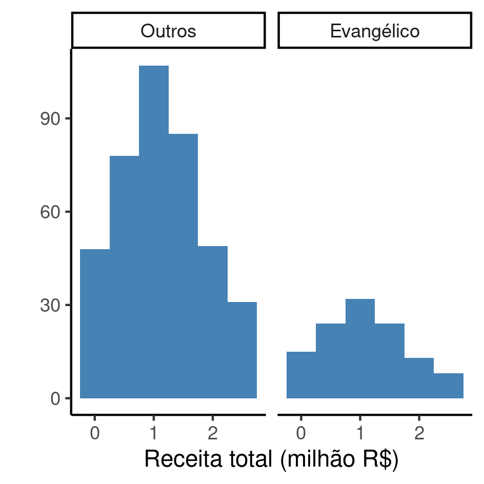

```{r setup, include=FALSE}
knitr::opts_chunk$set(echo = FALSE)
knitr::opts_knit$set(root.dir = normalizePath(".."))
options(scipen = 999)
library(pander)
library(knitr)
library(philsfmisc)
panderOptions('table.style', 'rmarkdown')
panderOptions('table.split.table', 160)
```

---

**Histórico do documento**

```{r history}
Version <- c("01")
Changes <- c("Versão inicial")
history <- cbind(Version, Changes)
colnames(history) <- c("Versão", "Alterações")
# pander(history, split.cells = 70)
kable(history)
```

---

# Lista de abreviaturas

- CI: Intervalo de confiança (*confidence interval*)
- CV: Coeficiente de Variação
- OR: razão de chances (*odds ratio*)

# Introdução

Aplicar método de seleção estatística ou redução dimensional de variáveis para selecionar as variáveis que têm maior contribuição na explicação da variância observada nos dados, e ajustar modelo de regressão logística para quantificar os efeitos das variáveis incluídas no modelo final.

Esta análise testou a hipótese de que
deputados federais da bancada evangélica que foram eleitos em 2018 podem ser identificados com base nas doações recebidas durante a campanha eleitoral, número de votos recebidos e outras características.

O posicionamento político dos deputados foi identificado pelo índice de Power e Silveira-Rodrigues (2018) que varia de -1 a 1, onde -1 é mais à esquerda e 1 mais à direita.

## Objetivos

Criar um modelo explicativo para quantificar o efeito da receita recebida durante a campanha por deputados federais eleitos em 2018 na classificação como pertencendo à bancada evangélica, ajustado pelo número de votos e outras características dos deputados e seus partidos.

## Recepção e tratamento dos dados

Base de dados recebida contendo características dos deputados federais eleitos em 2018.
Todas as variáveis da tabela de dados analíticos foram identificadas de acordo com as descrições das variáveis, e os valores foram identificados de acordo com o dicionário de dados providenciado.
Estas identificações possibilitarão a criação de tabelas de resultados com qualidade de produção final.

Foram feitos ajustes de escala em variáveis para facilitar a interpretação das estimativas da análise de regressão.
O Número de votos foi padronizado em votos por 100 mil e a Receita total em milhões de reais.

# Metodologia

```{r results, include=FALSE}
source("scripts/results.R", encoding = 'UTF-8')
```

## Variáveis

### Desfechos primário e secundário

O desfecho primário está definido como a classificação entre deputados da bancada evangélica e outros deputados explicada pela receita total recebida.

### Covariáveis

As seguintes características dos deputados federais foram consideradas para inclusão na análise: Número de votos recebidos, posicionamento político, capilaridade, a unidade da federação, o partido (sigla), o sexo e se é o primeiro mandato.
As seguintes características dos partidos foram consideradas para inclusão na análise:  decil do número de deputados eleitos e decil do número de filiados.

As receitas discriminadas em suas diversas origens não foram consideradas na análise, devido à baixa representatividade de valores em suas distribuições (figura A1).

## Análises Estatísticas

As características dos deputados foram descritas, por estado, como
média (DP)
<!-- mediana (IIQ) -->
ou frequência e proporção (%),
conforme apropriado.
As distribuições foram sumarizadas em tabelas e visualizadas em gráficos exploratórios

As inferências foram baseados no modelo de regressão binomial.
A classificação dos deputados como pertencendo ou não à bancada evangélica foi estabelecida por métodos extrâneos aos dados.
Como o desfecho primário é uma variável binária foi criado um modelo de regressão logística para quantificar a contribuição das variáveis disponíveis para explicar a associação com a classificação.
Não foram incluídos efeitos de interação entre as variáveis.
A técnica de seleção estatística de variáveis "para a frente" (*stepwise forward-selection*) para reduzir o número de variáveis que contribuam para a análise.
Foi usado o critério de p<0,20 para inclusão no modelo multivariado.
Os modelos criados foram comparados com o AIC.
Todos os modelos de regressão foram criados sem intercepto.

Todas as análises foram realizadas ao nível de significância de 5%.
Todos os testes de hipóteses e intervalos de confiança calculados foram
bicaudais.

### Softwares utilizados

Esta análise foi realizada utilizando-se o software `R` versão `r getRversion()`.

# Resultados

## Análise descritiva

<!-- dados da tabela adhoc em describe.R -->
Em 2018 foram eleitos 116 (23% dos 512 deputados avaliados) deputados federais que se autodenominaram evangélicos.
Destes,
29 (25%) estão filiados à igreja AD,
21 (18%) à igreja IURD e
15 (13%) à igreja Batista.
Observa-se nas duas classes de deputados federais uma predominância do sexo masculino, com
91 (78%) homens entre os deputados evangélicos e
346 (87%) homens dentre as demais classes
(Tabela 1).
O deputado federal evangélico parece ter posicionamento político mais alinhado à direita, com índice de Power e Silveira-Rodrigues médio 0.7.

A maior parte dos deputados federais eleitos em 2018 foram eleitos em primeiro mandato.
Dentro os deputados evangélicos
94 (81%) se elegeram pela primeira vez e
22 (19%) foram reeleitos.
Os candidatos evangélicos obtiveram, na média, 127 mil votos,
quando os outros deputados obtiveram 97 mil votos.
Apesar da discrepância nas médias de performance de votos, a variabilidade deste indicador é substancialmente maior na classe de deputados evangélicos, com desvio padrão superior à média.
A variabilidade entre os dois grupos pode ser comparada pelo CV -- o CV dos deputados evangélicos foi 157% enquanto nos outros foi 60%.
Ambos os grupos tiveram capilaridade semelhante, em torno de 0.8 na média.

Os partidos tiveram desempenho comparáveis, onde tanto
o decil do número de deputados eleitos como
o decil do número de filiados 
ficaram na faixa entre 0,7 e 0,8 (Tabela 1).
Os partidos que mais abrigaram os deputados evangélicos eleitos foram o
PRB com	23 (20%) deputados,
PSL com	16 (14%),
PR com	10 (8.6%) e
os partidos com menor representatividade desta classe foram
PATRIOTA,
PMN,
PRP e
PTC
todos com 1 (0.9%) deputado.

```{r tab_desc}
tab_desc %>%
    as_kable(
    align = "lccc",
    caption = "**Tabela 1** Características dos deputados federais eleitos em 2018."
  )
```

A receita total obtida pelos deputados evangélicos foi comparável aos demais deputados, com ambas as classes atingindo receita média superior a 1 milhão de reais.
Os deputados evangélicos obtiveram, na média, 1.08 milhões de reais (desvio padrão 0.7 milhões, CV 64%) e
os demais deputados 1.12 milhões de reais (desvio padrão 0.7 milhões, CV 60%).
A amplitude das receitas observadas variou entre
R\$ 21648 e R\$ 2507377 entre os deputados evangélicos e
R\$ 12075 e R\$ 2500500 entre os demais (Tabela 1 e Figura 1).

```{r fig1, fig.cap="**Figura 1** Distribuição da receita total dos deputados federais eleitos em 2018."}
# 
knitr::include_graphics("../figures/receita_total.png", error = FALSE)
```


## Estimativa da receita total recebida por deputados da bancada evangélica

```{r mod_stats}
est.crude <- inline_text(tab_mod.min, variable = total_receita)
est.adj <- inline_text(tab_mod.final, variable = total_receita)
```

A tabela 2 mostra as estimativas de efeito de cada variável que compõe o teste da hipótese central: de que há associação entre a receita total recebida durante a campanha pelos deputados federais do mandato iniciado em 2018 e a classificação como pertencente à bancada evangélica.
A estimativa bruta (modelo univariado) está significativamente associada com a razão de chances de pertencer à bancada evangélica e indica que os deputados da bancada evangélica tendem a receber 60% menos verba que os outros
(OR: `r est.crude`).

A seleção _stepwise_ de variáveis incluiu no modelo o partido, o sexo, a capilaridade e o número de votos dos deputados, ajustando a estimativa do efeito da receita total.
A inclusão das novas variáveis causou uma redução do AIC de `r format.float(m.aic$AIC[1])` para `r format.float(m.aic$AIC[2])`, o que indica um ajuste substancialmente melhor do modelo aos dados.
A estimativa ajustada do efeito da receita total indica um efeito menor que a estimativa bruta, onde a receita dos deputados evangélicos é aproximadamente 23% menor que os outros deputados
(OR: `r est.adj`).
A OR ajustada não foi significativamente diferente de 1.

A interpretação conjunta destes dois resultados é que, na média, a receita total dos deputados evangélicos é menor que a receita total dos outros deputados.
No entanto, o tamanho do efeito da receita, ajustado pelas outras variáveis, não pode ser estimado com precisão suficiente para quantificar sua magnitude.
Ver Observações na seção 5.

```{r tab_mod}
tab_mod %>%
    as_kable(
    align = "lccc",
    caption = "**Tabela 2** Efeito da receita total recebida por deputados federais na classificação como pertencente à bancada evangélica;
    modelos não ajustado e ajustado após seleção estatística de variáveis."
  )
# análise ad-hoc num_votos
# glm(evangelico ~ num_votos -1, analytical, family = binomial) %>% tbl_regression(exp = TRUE) %>% inline_text(variable = num_votos)
# lm(total_receita ~ num_votos -1, analytical) %>% tbl_regression() %>% inline_text(variable = num_votos)
```

O partido do deputado teve contribuição detectável na explicação dos fatores que determinam se o deputado pertence ou não à bancada evangélica.
No entanto, foram considerados trinta partidos e esta análise não possui poder suficiente para detectar os efeitos relativos a todos.
Pode-se identificar os partidos com proporção de deputados da bancada evangélica significativamente menor quando comparado aos outros deputados:
DEM,
MDB,
NOVO,
PATRIOTA,
PDT,
PODE,
PP,
PR,
PROS,
PRP,
PSB,
PSD,
PSDB,
PT,
PTB
e
SOLIDARIEDADE.
Não foi possível identificar os partidos com maior participação de deputados evangélicos.

As deputadas mulheres pareciam ser maioria na bancada evangélica, sendo três vezes mais prováveis de pertencer à bancada evangélica quando comparadas aos homens
(OR: `r inline_text(tab_mod.final, variable = sexo, level = "Feminino")`).
Apesar de obter uma receita menor os deputados da bancada evangélica atingem uma capilaridade significativamente maior quando comparados aos outros deputados
(OR: `r inline_text(tab_mod.final, variable = capilaridade)`).

Por fim, o número de votos parece ser um fator de confundimento.
<!-- Apesar de não ser significativo: para cada 100 mil votos recebidos a mais, a chance de um deputado ser da bancada evangélica parece aumentada no modelo ajustado -->
<!-- (OR: `r inline_text(tab_mod.final, variable = num_votos)`). -->
O número de votos não está na cadeia causal entre a receita e a classificação de bancada evangélica,
e também está associado tanto com a classificação em bancada evangélica
(OR: 0.49 (95% CI 0.41, 0.59; p<0.001)),
como com a receita total
(0.50 (95% CI 0.44, 0.56; p<0.001).
Como os critérios de confundimento foram preenchidos, esta variável foi mantida no modelo final para corrigir a estimativa do efeito da receita no desfecho do estudo.

# Exceções e Observações

# Conclusões

Durante a campanha os deputados federais da bancada evangélica recebem, tipicamente, uma receita total menor quando comparados aos outros deputados.
Apesar disso, eles
<!-- recebem 26% mais votos e -->
atingem maior capilaridade que os deputados não evangélicos.
Deputadas mulheres tem três vezes mais chance de pertencerem à bancada evangélica que homens.

Os partidos com menor proporção de deputados evangélicos são o
DEM,
MDB,
NOVO,
PATRIOTA,
PDT,
PODE,
PP,
PR,
PROS,
PRP,
PSB,
PSD,
PSDB,
PT,
PTB
e
SOLIDARIEDADE.
Não foi possível identificar os partidos com maior participação de deputados evangélicos.

# Referências

- **SAP-2021-012-JG-v01** -- Quantificação do efeito da receita recebida na classificação como bancada evangélica de deputados federais de 2018.
<!-- - Cohen, J. (1988). Statistical power analysis for the behavioral sciences (2nd Ed.). New York: Routledge. -->

# Apêndice

## Análise exploratória de dados

```{r A1, fig.cap="**Figura A1** Distribuição das receitas de deputados federais, por origem (agp = receita que veio do Partido ao invés de apoiadores privados (empresariais ou não); agr = setor agrícola; com = setor do comércio; fin = setor específico dos bancos e outras instituições financeiras e imobiliárias; ind = setores da indústria; inf = setor de infraestrutura; pf = pessoa física; rp = recursos próprios; ser = setor de serviços). "}

# 
knitr::include_graphics("../figures/receitas.png", error = FALSE)
```

## Disponibilidade

<!-- Tanto este documento como o plano analítico correspondente (**SAP-2021-012-JG-v01**) podem ser obtidos no seguinte endereço: -->

Este documento pode ser obtido no seguinte endereço:

https://github.com/philsf-biostat/SAR-2021-012-JG/

## Dados utilizados

Os dados utilizados neste relatório não podem ser publicados online por questões de sigilo.

```{r data}
# print analytical of analytical_mockup whether it is the private or public version of the SAR

# analytical %>%
#   pander(caption = "**Table A1** Tabela de dados analíticos")
analytical_mockup %>%
  pander(caption = "**Tabela A1** Estrutura da tabela de dados analíticos")
```
