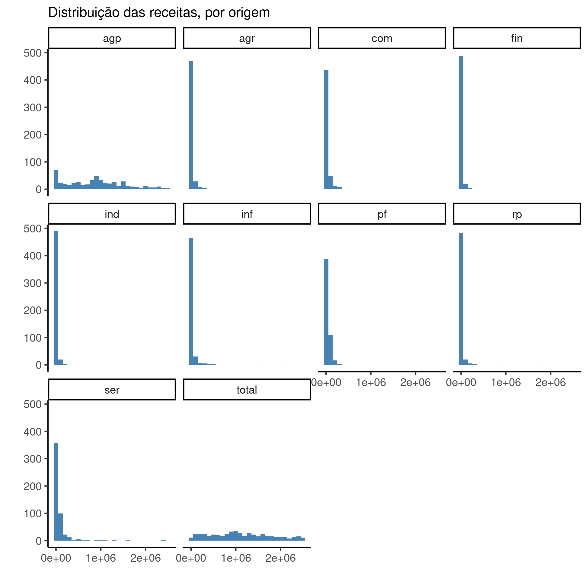

---

**Histórico do documento**

|Versão |Alterações     |
|:------|:--------------|
|01     |Versão inicial |

---

# Lista de abreviaturas

# Introdução

Aplicar método de seleção estatística ou redução dimensional de variáveis para selecionar as variáveis que têm maior contribuição na explicação da variância observada nos dados, e ajustar modelo de regressão logística para quantificar os efeitos das variáveis incluídas no modelo final.

## Objetivos

Quantificação do efeito do número de votos, doações recebidas e outras características de deputados federais na classificação como pertencendo à bancada evangélica.

## Recepção e tratamento dos dados

# Metodologia

## Variáveis

### Desfechos primário e secundário

O desfecho primário está definido como a classificação entre deputados da bancada evangélica e outros deputados explicada pela receita total recebida.

### Covariáveis

As seguintes características dos deputados federais foram consideradas para inclusão na análise: Número de votos recebidos, posicionamento político, capilaridade, a unidade da federação, o partido (sigla), o sexo e se é o primeiro mandato.
As seguintes características dos partidos foram consideradas para inclusão na análise:  decil do número de deputados eleitos e decil do número de filiados.

As receitas discriminadas em suas diversas origens não foram consideradas na análise, devido à baixa representatividade de valores em suas distribuições (figura A1).

## Análises Estatísticas

As características dos deputados foram descritas, por estado, como
média (DP)
<!-- mediana (IIQ) -->
ou frequência e proporção (%),
conforme apropriado.
As distribuições foram sumarizadas em tabelas e visualizadas em gráficos exploratórios

As inferências foram baseados no modelo de regressão binomial.
A classificação dos deputados como pertencendo ou não à bancada evangélica foi estabelecida por métodos extrâneos aos dados.
Como o desfecho primário é uma variável binária foi criado um modelo de regressão logística para quantificar a contribuição das variáveis disponíveis para explicar a associação com a classificação.
Não foram incluídos efeitos de interação entre as variáveis.
A técnica de seleção estatística de variáveis "para a frente" (*stepwise forward-selection*) para reduzir o número de variáveis que contribuam para a análise.
Foi usado o critério de p<0,20 para inclusão no modelo multivariado.
Os modelos intermediários criados foram comparados com o AIC.

Todas as análises foram realizadas ao nível de significância de 5%.
Todos os testes de hipóteses e intervalos de confiança calculados foram
bicaudais.

### Softwares utilizados

Esta análise foi realizada utilizando-se o software `R` versão 4.1.1.

# Resultados

## Análise descritiva

Table: **Tabela 1** caption

|**Características**                      | **Outros**, N = 398 | **Evangélico**, N = 116 |
|:----------------------------------------|:-------------------:|:-----------------------:|
|__Capilaridade__                         |     0.77 (0.16)     |       0.80 (0.16)       |
|__Releição vs primeiro mandato__         |                     |                         |
|Primeiro mandato                         |      346 (87%)      |        94 (81%)         |
|Reeleito                                 |      52 (13%)       |        22 (19%)         |
|__Sexo__                                 |                     |                         |
|Masculino                                |      346 (87%)      |        91 (78%)         |
|Feminino                                 |      52 (13%)       |        25 (22%)         |
|__Votos (100k)__                         |     0.97 (0.58)     |       1.27 (1.99)       |
|Desconhecido                             |          1          |            0            |
|__Índice de Power e Silveira-Rodrigues__ |     0.17 (0.50)     |       0.42 (0.30)       |
|__Decil do núm. de filiados__            |     0.79 (0.22)     |       0.70 (0.20)       |
|__Decil do núm. de deputados__           |     0.78 (0.22)     |       0.74 (0.22)       |
|__Receita total (milhão R$)__            |     1.12 (0.68)     |       1.08 (0.69)       |

## Modelo

A tabela 2 mostra as estimativas de efeito de cada variável que compõe o teste da hipótese central: de que há associação entre a receita total recebida durante a campanha pelos deputados federais do mandato iniciado em 2018 e a classificação como pertencente à bancada evangélica.
A estimativa bruta (modelo univariado) está significativamente associada com a razão de chances de pertencer à bancada evangélica e indica que os deputados da bancada evangélica tendem a receber 60% menos verba que os outros
(OR: 0.41 (95% CI 0.35, 0.49; p<0.001)).

A seleção _stepwise_ de variáveis incluiu no modelo o partido, o sexo, a capilaridade e o número de votos dos deputados, ajustando a estimativa do efeito da renda total.
A inclusão das novas variáveis causou uma redução do AIC de 584.99 para 489.63, o que indica um ajuste substancialmente melhor do modelo aos dados.
A estimativa ajustada do efeito da renda total indica um efeito menor que a estimativa bruta, onde a renda dos deputados evangélicos é aproximadamente 23% menor que os outros deputados
(OR: 0.77 (95% CI 0.46, 1.27; p=0.3)).

Table: **Tabela 2** Efeito da receita total recebida por deputados federais na classificação como pertencente à bancada evangélica;
    modelos não ajustado e ajustado após seleção estatística de variáveis.

|**Características**       | **OR** | **95% CI** | **valor p** |**OR** | **95% CI** | **valor p** |
|:-------------------------|:------:|:----------:|:-----------:|:------|:----------:|:-----------:|
|Receita total (milhão R$) |  0.41  | 0.35, 0.49 |   <0.001    |0.77   | 0.46, 1.27 |     0.3     |
|Partido                   |        |            |             |       |            |             |
|AVANTE                    |        |            |             |0.25   | 0.03, 1.87 |     0.2     |
|DC                        |        |            |             |0.00   |            |    >0.9     |
|DEM                       |        |            |             |0.04   | 0.01, 0.24 |   <0.001    |
|MDB                       |        |            |             |0.02   | 0.00, 0.16 |   <0.001    |
|NOVO                      |        |            |             |0.05   | 0.00, 0.35 |    0.005    |
|PATRIOTA                  |        |            |             |0.05   | 0.00, 0.52 |    0.024    |
|PC do B                   |        |            |             |0.00   |            |    >0.9     |
|PDT                       |        |            |             |0.01   | 0.00, 0.07 |   <0.001    |
|PHS                       |        |            |             |0.26   | 0.03, 1.92 |     0.2     |
|PMN                       |        |            |             |0.11   | 0.00, 1.46 |    0.11     |
|PODE                      |        |            |             |0.10   | 0.01, 0.70 |    0.024    |
|PP                        |        |            |             |0.03   | 0.00, 0.19 |   <0.001    |
|PPL                       |        |            |             |0.00   |            |    >0.9     |
|PPS                       |        |            |             |0.00   |            |    >0.9     |
|PR                        |        |            |             |0.07   | 0.01, 0.43 |    0.005    |
|PRB                       |        |            |             |0.56   | 0.11, 2.89 |     0.5     |
|PROS                      |        |            |             |0.11   | 0.01, 0.80 |    0.035    |
|PRP                       |        |            |             |0.05   | 0.00, 0.61 |    0.037    |
|PSB                       |        |            |             |0.02   | 0.00, 0.10 |   <0.001    |
|PSC                       |        |            |             |0.31   | 0.04, 2.59 |     0.3     |
|PSD                       |        |            |             |0.05   | 0.01, 0.26 |   <0.001    |
|PSDB                      |        |            |             |0.05   | 0.01, 0.25 |   <0.001    |
|PSL                       |        |            |             |0.04   | 0.01, 0.20 |   <0.001    |
|PSOL                      |        |            |             |0.00   |            |    >0.9     |
|PT                        |        |            |             |0.00   | 0.00, 0.03 |   <0.001    |
|PTB                       |        |            |             |0.05   | 0.00, 0.36 |    0.005    |
|PTC                       |        |            |             |0.08   | 0.00, 2.89 |    0.13     |
|PV                        |        |            |             |0.00   |            |    >0.9     |
|REDE                      |        |            |             |0.00   |            |    >0.9     |
|SOLIDARIEDADE             |        |            |             |0.05   | 0.01, 0.36 |    0.004    |
|Sexo                      |        |            |             |       |            |             |
|Masculino                 |        |            |             |       |            |             |
|Feminino                  |        |            |             |3.18   | 1.61, 6.28 |   <0.001    |
|Capilaridade              |        |            |             |9.01   | 1.69, 53.5 |    0.012    |
|Votos (100k)              |        |            |             |1.26   | 1.01, 1.73 |    0.10     |

# Exceções e Observações

# Conclusões

# Referências

- **SAP-2021-012-JG-v01** -- Plano Analítico para Classificação estatística de deputados federais como bancada evangélica.
<!-- - Cohen, J. (1988). Statistical power analysis for the behavioral sciences (2nd Ed.). New York: Routledge. -->

# Apêndice

## Análise exploratória de dados

**Figura A1** Distribuição das receitas de deputados federais, por origem (agp = receita que veio do Partido ao invés de apoiadores privados (empresariais ou não); agr = setor agrícola; com = setor do comércio; fin = setor específico dos bancos e outras instituições financeiras e imobiliárias; ind = setores da indústria; inf = setor de infra-estrutura; pf = pessoa física; rp = recursos próprios; ser = setor de serviços). 

## Disponibilidade

<!-- Tanto este documento como o plano analítico correspondente (**SAP-2021-012-JG-v01**) podem ser obtidos no seguinte endereço: -->

Este documento pode ser obtido no seguinte endereço:

https://github.com/philsf-biostat/SAR-2021-012-JG/

## Dados utilizados

Os dados utilizados neste relatório não podem ser publicados online por questões de sigilo.

| id  | partido | uf | capilaridade | primeira | sexo | evangelico | num_votos | posicao | decil_filiados | decil_deputados | total_receita |
|:---:|:-------:|:--:|:------------:|:--------:|:----:|:----------:|:---------:|:-------:|:--------------:|:---------------:|:-------------:|
|  1  |         |    |              |          |      |            |           |         |                |                 |               |
|  2  |         |    |              |          |      |            |           |         |                |                 |               |
|  3  |         |    |              |          |      |            |           |         |                |                 |               |
| ... |         |    |              |          |      |            |           |         |                |                 |               |
| 514 |         |    |              |          |      |            |           |         |                |                 |               |

Table: **Table A1** Estrutura da tabela de dados analíticos
